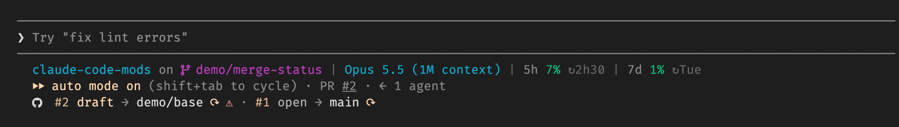
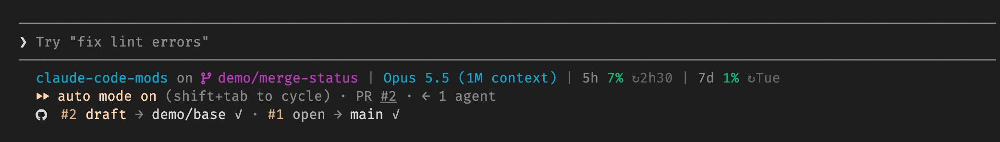
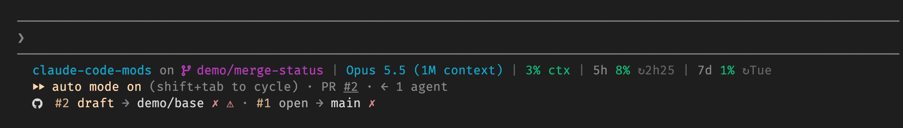
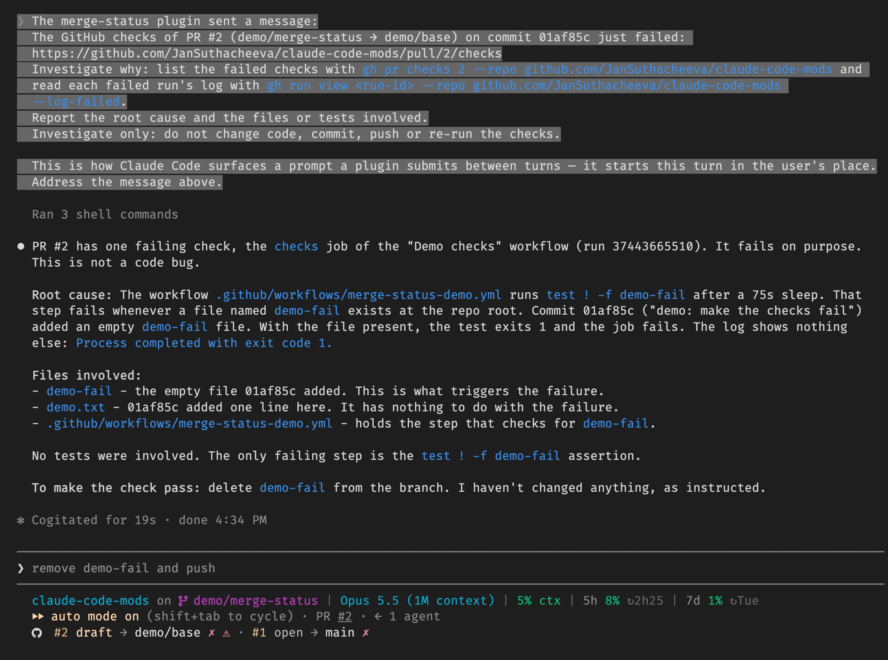
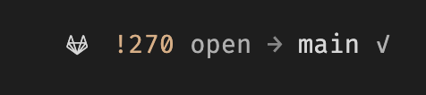
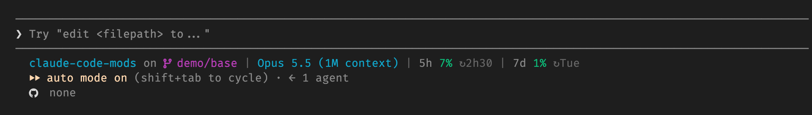
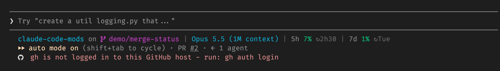

# merge-status

A Claude Code mod that shows the open merge requests (GitLab) or pull requests (GitHub) of your current branch in a row under the prompt:



Only open MRs and PRs are shown, drafts included. Merged and closed ones are left out, and a branch without an open one shows `none`.

The forge comes from the `origin` remote: a host of `github.com` or one starting with `github.` (GitHub Enterprise, for example `github.acme.com`) is GitHub and uses `gh`; any other host is GitLab and uses `glab`.
In the rest of this README, "MR" covers GitHub pull requests too.

## Screenshots

Taken in Claude Code on this repository's demo pull requests, and on a GitLab merge request.

**Checks passed** on both pull requests:



**Checks failed**, with a merge conflict on the draft:



**Claude investigates the failure** on its own, without changing code:



**GitLab** merge requests through `glab`:



**No open pull request** on the branch:



**A setup hint** when the CLI is not logged in:



## Features

- **GitLab and GitHub:** GitLab merge requests through `glab`, GitHub pull requests through `gh`, picked from the `origin` remote.
- **Pipeline and conflicts at a glance:** one sign per MR for the pipeline (passed, running, failed, none) and a warning for merge conflicts. On GitHub, all checks of the head commit count as its pipeline.
- **Follows your Claude Code theme:** all colors come from the theme, and switching it with `/theme` recolors the row right away.
- **Stays current on its own:** refreshes after a checkout, switch, push, pull or new MR, whether Claude runs it or you do, and drops MRs merged or closed elsewhere.
- **No stale results after a push:** waits for the new pipeline instead of showing the previous one as passed.
- **Investigates failed pipelines:** when a pipeline you saw running fails, Claude looks into the failed jobs and reports the cause, without changing code.
- **Clickable MRs:** each MR number links to its page, and `/mr` opens one in your browser.
- **Light on resources:** runs `glab` or `gh` and local `git` only, and costs no tokens apart from failure investigations. Pipelines are polled only while running or failed; otherwise one call every 2 minutes re-lists the open MRs.
- **Clear setup hints:** if the CLI for your forge is missing or not logged in, the row says what to run.
- **Cross-platform:** macOS, Linux and Windows.

## Requirements

- **Claude Code with function-hook plugins (mods)**, tested on 2.1.291. The mod API is in early access and may change between releases.
- **For GitLab: [glab](https://gitlab.com/gitlab-org/cli)**, the GitLab CLI, on your `PATH` (tested with 1.80),
  logged in to your GitLab host. See its [installation guide](https://gitlab.com/gitlab-org/cli#installation), for example:
  ```sh
  brew install glab          # macOS, Linux (Homebrew)
  winget install GLab.GLab   # Windows
  glab auth login --hostname git.example.com
  ```
- **For GitHub: [gh](https://cli.github.com)**, the GitHub CLI, on your `PATH` (tested with 2.73),
  logged in to your GitHub host. See its [installation guide](https://github.com/cli/cli#installation), for example:
  ```sh
  brew install gh            # macOS, Linux (Homebrew)
  winget install GitHub.cli  # Windows
  gh auth login
  ```
  You only need the CLI of the forge you use.
- **An `origin` remote on that host.** Repositories without an `origin` remote are ignored.
- **Optional: a [Nerd Font](https://www.nerdfonts.com)** in your terminal for the GitLab and GitHub logos.
  Without one, set `icons` to `text` (see [Settings](#settings)).
- **macOS, Linux or Windows.** `/mr` opens links with `open` on macOS, `xdg-open` on Linux
  and the system URL handler on Windows. Developed and verified on macOS; Linux and Windows are covered by tests only.

If the CLI is missing or not logged in, the row says so and tells you how to fix it.

## Install

1. Install the CLI of your forge and log in: `glab auth login` for GitLab, `gh auth login` for GitHub
   (see [Requirements](#requirements)).
2. In Claude Code, add the marketplace and install the mod:
   ```
   /plugin marketplace add JanSuthacheeva/claude-code-mods
   /plugin install merge-status@claude-code-mods
   ```
3. No Nerd Font in your terminal? Switch the logo to a text label:
   ```
   /plugin configure merge-status@claude-code-mods
   ```
   and set `icons` to `text`.
4. Restart Claude Code. In a repository with an open MR or PR on its current branch, the row appears under the prompt.

For development, link a clone of this repository instead:

```sh
ln -s "$PWD/claude-code-mods/merge-status" ~/.claude/skills/merge-status
```

## The row

| Sign             | Meaning                                |
| ---------------- | -------------------------------------- |
| `!3609` / `#128` | MR or PR number, linked to its page    |
| `open` / `draft` | Open MR, ready or draft                |
| `→ develop`      | Target branch                          |
| `✓` `⟳` `✗` `○`  | Pipeline passed, running, failed, none |
| `⚠`              | Merge conflict                         |

MRs are ordered by target branch: feature and bugfix branches first, then `develop`, `sprint-*` and `main`.

## Settings

| Setting | Values                             | Default     |
| ------- | ---------------------------------- | ----------- |
| `icons` | `nerd-font`: GitLab or GitHub logo | `nerd-font` |
|         | `text`: `MR` or `PR` label         |             |

Change it with `/plugin configure merge-status@claude-code-mods` in Claude Code, then restart.

## Commands

- `/mrs` hides or shows the row.
- `/mr` opens the first MR in the browser, `/mr 2` the second, `/mr 3609` a specific one.

## What it fetches, and when

Everything runs through `glab` or `gh` and local `git`; nothing reaches the model or costs tokens, except failure investigations.

- **Full refresh** on session start and after a checkout, switch, push, pull, `glab mr create` or `gh pr create`,
  whether Claude runs it or you do (a local git check runs every 15 seconds).
- **Open MRs** are re-listed every 2 minutes, so MRs merged or closed elsewhere disappear.
- **Pipelines** are polled every 30 seconds while running and every 2 minutes after failing, and never once passed.
  Right after a push, the previous pipeline counts as running until the forge starts the new one.
- **Failed pipelines** you saw running start one Claude turn that investigates the failure and reports the cause,
  without changing code. This turn costs tokens.

## Development

```sh
claude plugin validate .
claude plugin test .
```
