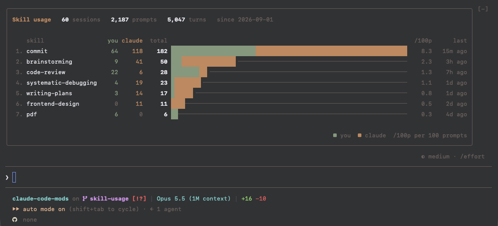
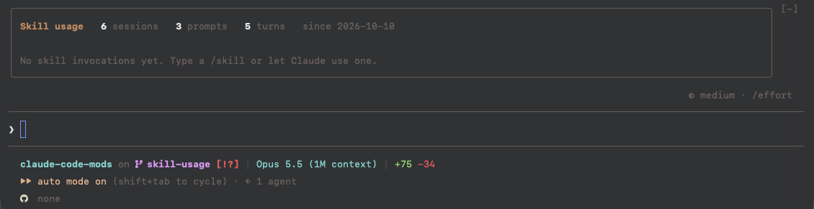

# skill-usage

A Claude Code mod that counts how often each skill is invoked, by you and by Claude, and shows the counts in a band above the prompt:



Counts are set against sessions, prompts and turns, so you can see that across 50 sessions and 5,000 turns a skill was invoked 100 times.

## Screenshots

Taken in Claude Code with made-up counts.

**No invocations yet**, before any skill was used:



## Features

- **You or Claude:** tells skills you typed as `/name` apart from skills Claude invoked through the Skill tool, in the main conversation or a subagent.
- **Counts in context:** sessions, prompts and turns are counted alongside, and `/100p` gives each skill's invocations per 100 prompts.
- **Ranked at a glance:** skills are ordered by total invocations, with a bar split into your share and Claude's, and when each was last used.
- **Follows your Claude Code theme:** all colors come from the theme, and switching it with `/theme` recolors the band right away.
- **Shared across sessions:** one small JSON file holds the counts for every session and project, and parallel sessions never overwrite each other's counts.
- **Light on resources:** reads and writes one local file only, and costs no tokens.
- **Fits the terminal:** the bar and name columns shrink to the terminal width, and skills beyond the band's height are summed up as `+N more`.

## Requirements

- **Claude Code with function-hook plugins (mods)**, tested on 2.1.293. The mod API is in early access and may change between releases.

## Install

1. In Claude Code, add the marketplace and install the mod:
   ```
   /plugin marketplace add JanSuthacheeva/claude-code-mods
   /plugin install skill-usage@claude-code-mods
   ```
2. Restart Claude Code. Counting starts right away; run `/skill-usage` to see the band.

For development, link a clone of this repository instead:

```sh
ln -s "$PWD/claude-code-mods/skill-usage" ~/.claude/skills/skill-usage
```

## The band

| Column   | Meaning                                              |
| -------- | ---------------------------------------------------- |
| `you`    | Invocations you typed as `/name`                     |
| `claude` | Invocations Claude made through the Skill tool       |
| `total`  | Both together, the order of the list                 |
| bar      | Your share, then Claude's, scaled to the top skill   |
| `/100p`  | Invocations per 100 prompts                          |
| `last`   | When the skill was last invoked, by you or by Claude |

## Commands

- `/skill-usage` shows or hides the band.

## What it counts

- **you:** a skill you invoked by typing `/name`.
- **claude:** a skill Claude invoked through the Skill tool, in the main conversation or a subagent.
- **preload:** a skill whose prompt was expanded without either, such as one preloaded into a subagent. Kept in the file, left out of the band.
- **sessions:** each Claude Code session the mod ran in, once, however often it reloads.
- **prompts:** the messages you sent, at the terminal or through Remote Control.
- **turns:** the model turns, including the ones that continue without a new prompt.

## Storage

The counts are kept in `~/.claude/skill-usage.json`:

```json
{
  "since": "2026-10-08T04:50:54.943Z",
  "sessions": 12,
  "prompts": 340,
  "turns": 1204,
  "skills": {
    "commit": {
      "user": 12,
      "claude": 30,
      "preload": 0,
      "lastUsed": "2026-10-08T09:12:03.120Z"
    }
  }
}
```

Delete the file to start counting afresh.

## Development

```sh
claude plugin validate .
claude plugin test .
```
